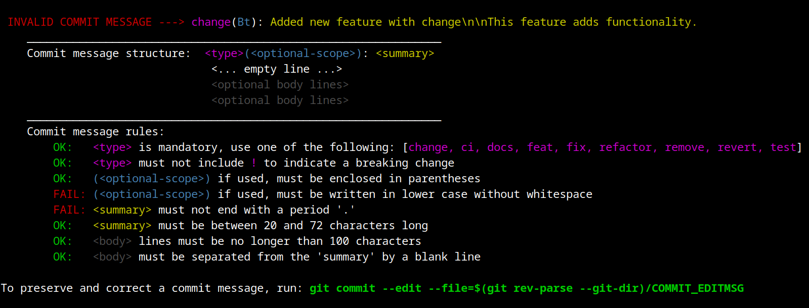
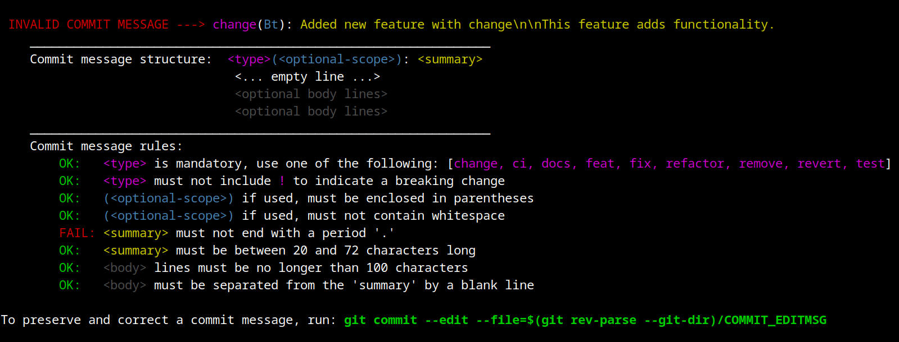

<div align="center">
  <h1>Conventional Precommit Linter</h1>
  
  <br>
  <br>
  <!-- GitHub Badges -->
   
   
</div>
The Conventional Precommit Linter is a tool designed to ensure commit messages follow the Conventional Commits standard, enhancing the readability and traceability of your project's history.
<hr>

- [Usage](#usage)
  - [Commit Message Structure](#commit-message-structure)
- [Setup](#setup)
  - [Install Commit-msg Hooks](#install-commit-msg-hooks)
  - [Configuration](#configuration)
- [Project issues](#project-issues)
- [Contributing](#contributing)
- [Credits](#credits)

---

## Usage

The _conventional-precommit-linter hook_ runs every time you execute the `git commit` command (when you want to commit your changes). Since this hook operates in the `commit-msg` stage, simply running a pre-commit check without actually committing (using `pre-commit run`), will have no effect, and this hook will be ignored.

The same applies to running pre-commit hooks in CI (Continuous Integration) job environments - **this hook is simply skipped when you run pre-commit checks in your CI system**.

### Commit Message Structure

Commit messages are validated against the following format:

```
<type>(<optional-scope>): <summary>
  < ... empty line ... >
<optional body lines>
<optional body lines>
<optional body lines>
```

Each component is checked for compliance with the provided or default configuration.

If your commit message does not meet the required format, the hook will fail, producing a **report that shows which part of your commit message needs correction**:



For a custom configuration, the report might look like this:


The hint message suggests that you can preserve your original message and simply edit it in your default editor, without the need to type the whole message again.

To edit failed message, run the command (as the hint suggests):

```sh
git commit --edit --file=$(git rev-parse --git-dir)/COMMIT_EDITMSG
```

Since this command is quite complex and you may use this functionality often, **creating a Git alias might be a good idea**:

```sh
git config --global alias.again '!git commit --edit --file=$(git rev-parse --git-dir)/COMMIT_EDITMSG'
```

This command adds a `git again` alias to your machine's Git configuration. You can run then simply `git again` whenever your commit message check fails.

---

## Setup

To integrate the **Conventional Precommit Linter** into your project, add to your `.pre-commit-config.yaml`:

```yaml
# FILE: .pre-commit-config.yaml
repos:
  - repo: https://github.com/espressif/conventional-precommit-linter
    rev: v1.7.0 # The version tag you wish to use
    hooks:
      - id: conventional-precommit-linter
        stages: [commit-msg]
```

### Install Commit-msg Hooks

**IMPORTANT:** `commit-msg` hooks require a specific installation command:

```sh
pre-commit install -t pre-commit -t commit-msg
```

**Note:** The `pre-commit install` command by default sets up only the `pre-commit` stage hooks. The additional flag `-t commit-msg` is necessary to set up `commit-msg` stage hooks.

For a simplified setup (just with `pre-commit install` without flags), ensure your `.pre-commit-config.yaml` contains the following:

```yaml
# FILE: .pre-commit-config.yaml
---
minimum_pre_commit_version: 3.3.0
default_install_hook_types: [pre-commit, commit-msg]
```

After modifying `.pre-commit-config.yaml`, re-run the installation command (`pre-commit install`) for changes to take effect.

-

### Configuration

The linter accepts several configurable parameters to tailor commit message validation:

- `--types`: Define the types of commits allowed (default: [`change`, `ci`, `docs`, `feat`, `fix`, `refactor`, `remove`, `revert`, `test`]).
- `--scopes`: Specifies a list of allowed scopes. If not defined, all scopes are allowed (restriction is `disabled`).
- `--scope-case-insensitive`: Allows uppercase letters in scope.
- `--subject-min-length`: Set the minimum length for the summary (default: `20`).
- `--subject-max-length`: Set the maximum length for the summary (default: `72`).
- `--body-max-line-length`: Set the maximum line length for the body (default: `100`).
- `--summary-uppercase`: Enforce the summary to start with an uppercase letter (default: `disabled`).
- `--allow-breaking`: Allow exclamation mark in the commit type (default: `false`).

The **custom configuration** can be specified in `.pre-commit-config.yaml` like this:

```yaml
# FILE: .pre-commit-config.yaml
---
- repo: https://github.com/espressif/conventional-precommit-linter
  rev: v1.7.0 # The version tag you wish to use
  hooks:
    - id: conventional-precommit-linter
      stages: [commit-msg]
      args:
        - --types=build,ci,docs,feat,fix,perf,refactor,style,test # default Angular / @commitlint-conventional types
        - --scopes=bt,wifi,ethernet
        - --subject-min-length=10
```

---

## Project issues

If you encounter any issues, feel free to report them in the [project's issues](https://github.com/espressif/conventional-precommit-linter/issues) or create Pull Request with your suggestion.

---

## Contributing

📘 If you are interested in contributing to this project, see the [project Contributing Guide](CONTRIBUTING.md).

---

## Credits

Inspired by project: https://github.com/compilerla/conventional-pre-commit
