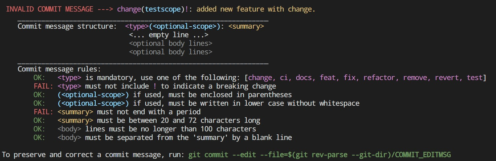
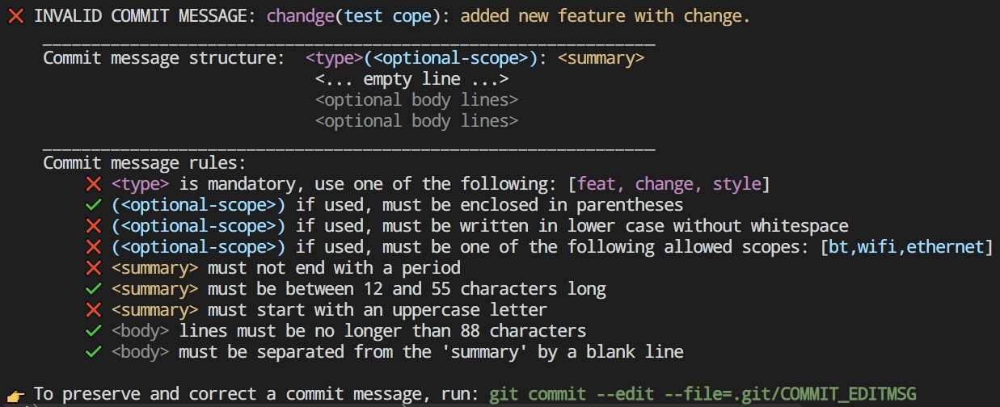

<div align="center">
  <h1>Conventional Precommit Linter</h1>
  
  <br>
  <br>
  <!-- GitHub Badges -->
   
   
</div>
The Conventional Precommit Linter is a tool designed to ensure commit messages follow the Conventional Commits standard, enhancing the readability and traceability of your project's history.
<hr>


## Table of Contents

- [Table of Contents](#table-of-contents)
- [Getting Started](#getting-started)
  - [Commit Message Structure](#commit-message-structure)
  - [Installation](#installation)
  - [Install Commit-msg Hooks](#install-commit-msg-hooks)
- [Configuration](#configuration)
- [Contributing and Development](#contributing-and-development)
- [Credits](#credits)

***

## Getting Started

### Commit Message Structure
Commit messages are validated against the following format:
```
<type>(<optional-scope>): <summary>
  < ... empty line ... >
<optional body lines>
<optional body lines>
<optional body lines>
```
Each component is checked for compliance with the provided or default configuration.

**Example output for failed message:**


**Example output for failed message (with custom arguments):**


### Installation

To integrate the **Conventional Precommit Linter** into your project, add to your `.pre-commit-config.yaml`:

```yaml
# FILE: .pre-commit-config.yaml
repos:
  - repo: https://github.com/espressif/conventional-precommit-linter
    rev: v1.3.0  # The version tag you wish to use
    hooks:
      - id: conventional-precommit-linter
        stages: [commit-msg]
```

### Install Commit-msg Hooks
**IMPORTANT:** `commit-msg` hooks require a specific installation command:
```sh
pre-commit install -t pre-commit -t commit-msg
```

**Note:** The `pre-commit install` command by default sets up only the `pre-commit` stage hooks. The additional flag `-t commit-msg` is necessary to set up `commit-msg` stage hooks.

For a simplified setup (just with `pre-commit install` without flags), ensure your `.pre-commit-config.yaml` contains the following:
```yaml
# FILE: .pre-commit-config.yaml
---
minimum_pre_commit_version: 3.3.0
default_install_hook_types: [pre-commit,commit-msg]
...
```
After modifying `.pre-commit-config.yaml`, re-run the install command (`pre-commit install`) for changes to take effect.


## Configuration

The linter accepts several configurable parameters to tailor commit message validation:
- `--types`: Define the types of commits allowed (default: [`change`, `ci`, `docs`, `feat`, `fix`, `refactor`, `remove`, `revert`]).
- `--scopes`: Specifies a list of allowed scopes. If not defined, all scopes are allowed (restriction is `disabled`).
- `--subject-min-length`: Set the minimum length for the summary (default: `20`).
- `--subject-max-length`: Set the maximum length for the summary (default: `72`).
- `--body-max-line-length`: Set the maximum line length for the body (default: `100`).
- `--summary-uppercase`: Enforce the summary to start with an uppercase letter (default: `disabled`).

The **custom configuration** can be specified in `.pre-commit-config.yaml` like this:
```yaml
# FILE: .pre-commit-config.yaml
...
- repo: https://github.com/espressif/conventional-precommit-linter
  rev: v1.3.0  # The version tag you wish to use
  hooks:
    - id: conventional-precommit-linter
      stages: [commit-msg]
      args:
        - --types=change,ci,docs,feat,fix,refactor,remove,revert,fox
        - --scopes=bt,wifi,ethernet
        - --subject-min-length=10
```

***

## Contributing and Development

We welcome contributions! To contribute to this repository, please follow these steps:

1. **Clone the Project**: Clone the repository to your local machine using:
    ```sh
    git clone https://github.com/espressif/conventional-precommit-linter.git
    ```

2. **Set Up Development Environment:**

- Create and activate a virtual environment:
  ```sh
  virtualenv venv -p python3.8 && source ./venv/bin/activate
  ```
  or
  ```sh
  python -m venv venv && source ./venv/bin/activate
  ```

- Install the project and development dependencies:
  ```sh
  pip install -e '.[dev]'
  ```

3. **Testing Your Changes:**

- Create a file named `test_message.txt` in the root of the repository (this file is git-ignored) and place an example commit message in it.

- Run the tool to lint the message:
  ```sh
    python -m conventional_precommit_linter.hook test_message.txt
  ```

  ... or with arguments:
  ```sh
  python -m conventional_precommit_linter.hook test_message.txt --subject-min-length="12" --subject-max-length="55" --body-max-line-length="88" --types="feat,change,style" --scopes="bt,wifi,ethernet"
  ```


Before submitting a pull request, ensure your changes pass all the tests. You can run the test suite with the following command:
```sh
pytest
```

Please also adhere to the Conventional Commits standard when writing your commit messages for this project.

***

## Credits
Inspired by project: https://github.com/compilerla/conventional-pre-commit
